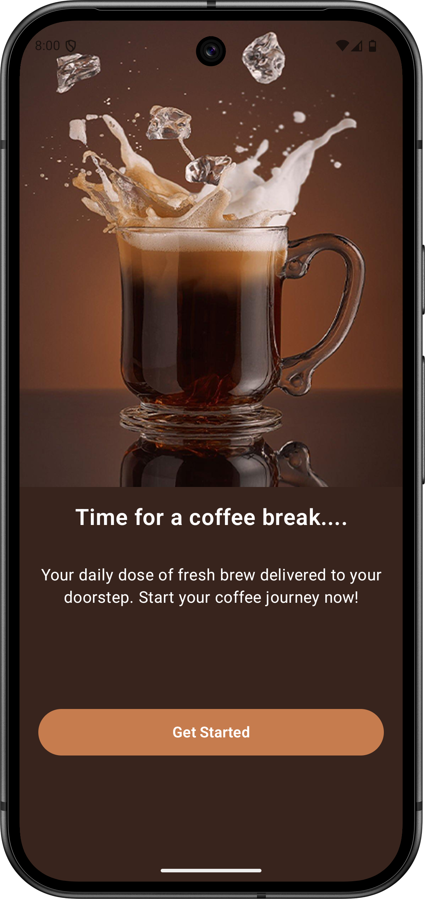
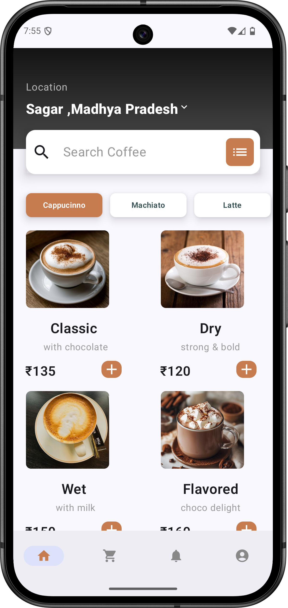
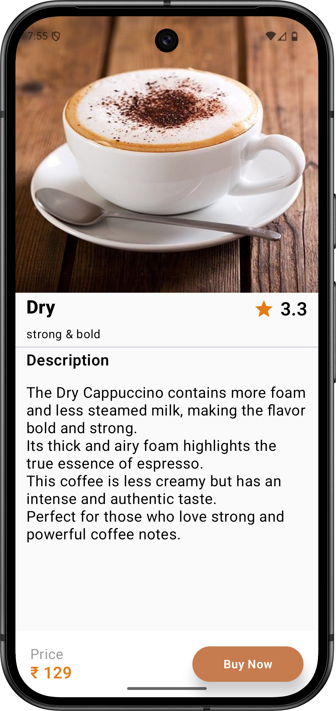

# ☕ Sip Coffee App  

Sip Coffee App is a modern **Jetpack Compose Android application** designed for coffee lovers.  
It provides an easy way to browse, explore, and buy different types of coffee with a clean UI and smooth navigation.  

---

## 🚀 Features
- Beautiful splash & onboarding screen  
- Coffee product listing with images, price & details  
- Product detail screen with description and rating  
- Cart screen & notification screen (dummy for now)  
- Modern **Material3 + Jetpack Compose UI**  
- Bottom navigation for smooth navigation between screens  

---
## 🛠️ Tech Stack  
- **Language:** Kotlin  
- **UI:** Jetpack Compose, Material3  
- **Architecture:** Single-Activity with Compose Navigation  

---

## 👨‍💻 Author

- [Madhav Gadge](https://github.com/madhavgadge)
- [LinkDin](https://www.linkedin.com/in/madhav-gadge-610177343?utm_source=share&utm_campaign=share_via&utm_content=profile&utm_medium=android_app)
- [Mail](madhavgadge01@gmail.com)

  
## 📸 Screenshots  

| Splash / First Screen | Home Screen | Buy Screen |
|------------------------|-------------|-------------|
|  |  |  |

---

